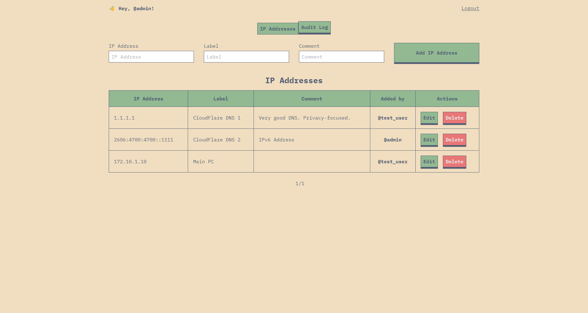
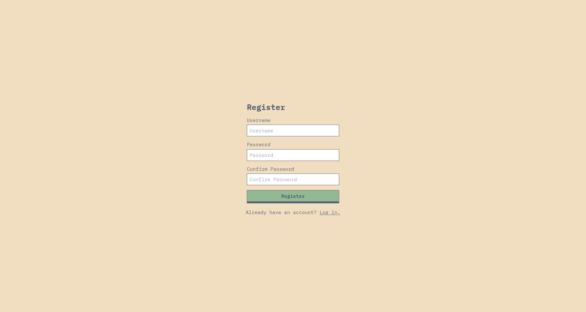
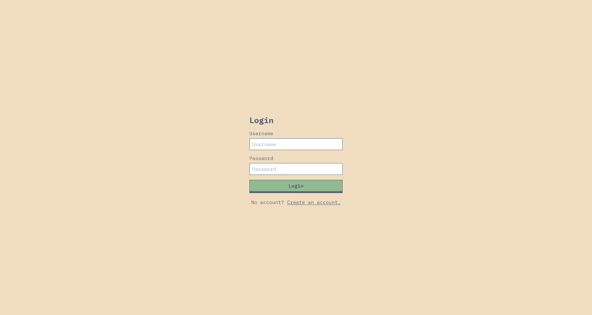
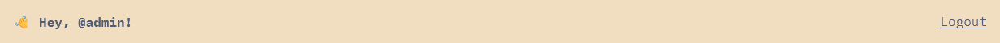
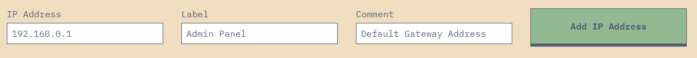
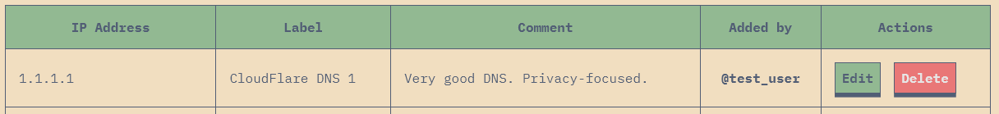
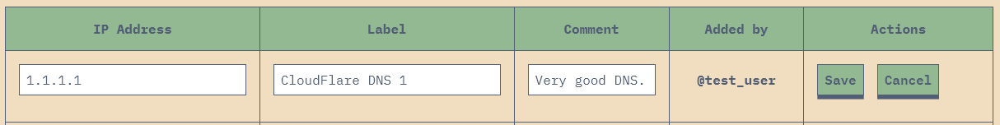
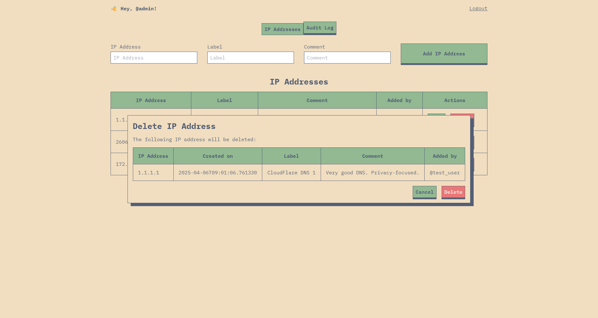
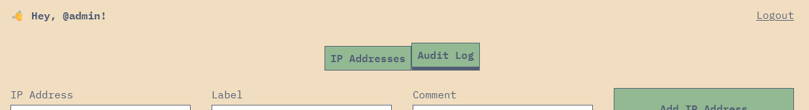
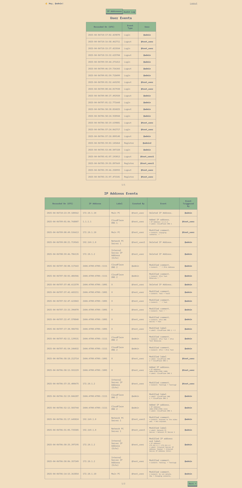

# TechLint Examination Project: Web-Based IP Address Management System



This project is a system built by [Sean Ballais](https://seanballais.com) as
part of his technical examination at TechLint. It lets you manage IP addresses
from different users, while also tracking changes made to the IP addresses by
users and user actions like logins, logouts, and registrations.

## Built With

This project is built using Python and FastAPI in the backend, and TypeScript
and React for the frontend. Docker is also used for development and for the
environment in which this project lives.

## Architecture

The app is divided into four main components:

- Auth Service (handles user and authentication tasks)
- IP Service (handles IP address-related tasks)
- Gateway Service (handles communications from and to clients)
- Web App Client (the client that users use to interact with this project)

The Auth service and IP service do not communicate with each other. They do not
know about each other's existence. The only service they communicate with is
the gateway service, which is also the only service the web app client talks
with. This manner of communication simplifies our architecture and reduces
complexities.

## Installation

### Prerequisites

To run and set up this project, you will simply need to have Docker and Docker
Compose installed and set up in your system. There are no other dependencies
since Docker will handle everything else for us. Neat, right? From here on out,
we will be assuming that you have Docker and Docker Compose ready.

### Setting Things Up

Clone this project into a directory of your choice and set the repo as your
current working directory:

```bash
$ cd /path/to/working/directory/
$ git clone https://github.com/seanballais/techlint-interview.git
$ cd techlint-interview/
```

We will then build and run our containers.

```bash
$ docker compose up --build
```

At this point, assuming there are no issues with the creation of our
containers, we're almost ready, and we just need to create the database
schemas.
In another shell, run one of the following commands, depending on your system.
Note that without this step, our app will not work properly.

#### PowerShell

We just need to run one command since we have a PowerShell script created for
this step.

```
$ .\scripts\create-docker-dbs.ps1
```

#### Bash/ZSH

```bash
$ docker compose exec -it auth python ./scripts/create-db.py
$ docker compose exec -it ip python ./scripts/create-db.py
```

And we're done! 🎉 You can now access the project from the following URL:

```
http://localhost:8080/
```

## Usage

### Creating an Account

We can create a regular user from the app itself, but only if you are logged
out. From
the homepage, click on the "Create an account." link. This will lead you to the
registration panel.



Simply enter a username and a password (you have enter your password twice,
with the second one as confirmation). Note that **usernames may only contain
letters, digits, periods, and underscores**. On the other hand, **passwords
must
have a minimum length of 12**. Once you have provided valid credentials,
you will be redirected to the dashboard where you can manage IP addresses.

#### Creating a Superuser

The steps above will only let you create a regular user, which has limited
privileges. In order for us to be able to edit and delete any IP addresses, and
view the audit log, we need to be a superuser.

Creating a superuser account is slightly more work, but should not be too
difficult. To create a superuser, just open up a new shell of your choice, and
run the following command in directory where you cloned this repository.

```bash
$ docker compose exec -it auth python ./scripts/create-superuser.py
```

This command will present you with an interactive session where you can enter
the credentials for the superuser. Afterwards, you should now have a superuser
account.

### Login

Logging in the app is simple. Just open up the app, and enter your credentials.
If you are in the registration panel, you can simply head to the login form by
either reloading the page or clicking on "Log in." link at the bottom of the
form.



### Logout

To logout from the app, simply click on the "Logout" link at the rightmost side
of the header on top
of the app.



### Adding IP Addresses

You can add an IP address using the topmost form in the IP Addresses panel in
the app. Simply enter the IP address, its label, and, optionally, a comment for
the IP address and click "Add IP Address" button.



If the IP address data you entered are all valid, then you will have
successfully created an IP address record into the app, which will then appear
in the IP addresses table, found below the aforementioned form.

Note that when you add an IP address, make sure that the IP address is valid
and the label is not empty.

### Editing an IP Address

You can start editing an IP address record by clicking on the "Edit" button
located in its row in the IP addresses table in the homepage.



After clicking the button, you will be able to modify the IP address and its
data. Make sure that the IP address is still valid and that the label is not
empty. Note that only comments may be empty.



If you are satisfied with the changes, you can save them by clicking on the "
Save" button, and the changes will be saved and will reflect in the table as
well. However, if you wish to undo your changes, you can click on the "Cancel"
button and changes will not be saved.

Note that regular users can only edit the IP addresses they have added, while
superusers will be able to modify all IP addresses.

### Deleting an IP Address (✨ Superusers Only!)

Superusers will be able to delete any IP address. This can be started by
clicking on the "Delete" button of an IP address, which will also only be shown
to superusers.


Clicking the "Delete" button will trigger a confirmation pop up asking for
confirmation from the superuser whether to proceed with deleting the IP address
or not.



Clicking on the "Delete" button will delete the IP address. However, if the
superuser does not want to proceed with the deletion, they may click anywhere
outside of the dialog or the "Cancel" button to hide the dialog.

### Viewing the Audit Log (✨ Superusers Only!)

The audit log tracks all the user events (i.e. log ins, log outs, and
registrations), changes to an IP address, and creation/deletion of IP
addresses. Only superusers are allowed to view this panel.

To access the audit log, click the "Audit Log" tab button in the tab bar at the
top of the app.



From there, you can now see the audit log, which is divided into two parts: (a)
user events, and (b) IP address events.

The first table shows the user events, while the last table shows the IP
address events.



## Possible Improvements

The project is not perfect by any means, and may be further improved. Here are
a list of possible improvements that I have identified so far:

- In-depth roles were removed for a flatter user model with the role coupled to
  the model for now. Normalized roles should be considered later.
- Better error messages and handling.
- In-depth code testing.
- Creation and update date for the user model.
- More thoroughly thought out API design.
- More specific HTTP status codes.
- Logging.
- Did not consider doing more with the case where an event was logged with an
  event type that was not yet in the database.
- An audit log that combines the logs from the auth and IP address services.
- Better security for the access and refresh tokens. API does not support a set
  up where the tokens are stored securely as
  described [here](https://stackoverflow.com/a/61106253/1116098).
- Mobile support.
- Admin controls on other users (e.g. adding, modifying, and deleting other
  users).
- Better tweaked UI.
- Prepare a production version of the Docker Compose file.
- Email confirmation for users to give ourselves a notable degree of protection
  from bots.
- Custom logo.
- Better README file.

## License and Credits

This project is not licensed under any license. As such, please do not use any
part of the code here without my prior knowledge nor permission, whether for
your own projects or (most especially) AI training.

Some parts of the app was based on third-party code. See [
`LICENSE.3RD-PARTY`](/LICENSE.3RD-PARTY) for details. Some code used in this
project are based on online sources, such as but not limited to blogs
and [StackOverflow](https://stackoverflow.com) answers. The links to such
sources are included in the individual files with code based off of such
sources.

## Contact

Sean Francis N.
Ballais - [@seanballais.com](https://bsky.app/profile/seanballais.com) - [sean@seanballais.com](mailto:sean@seanballais.com)
